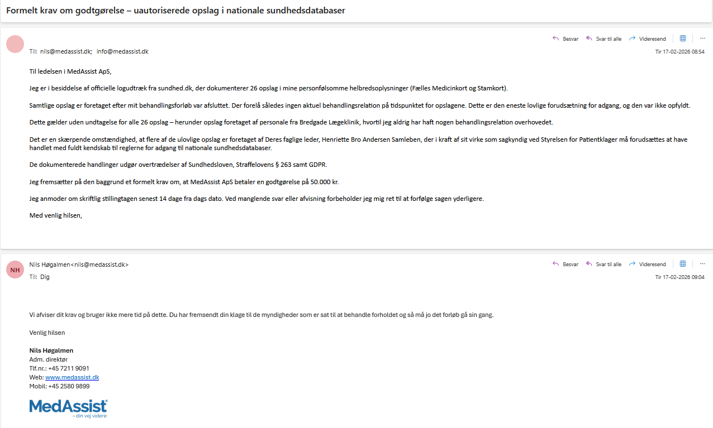
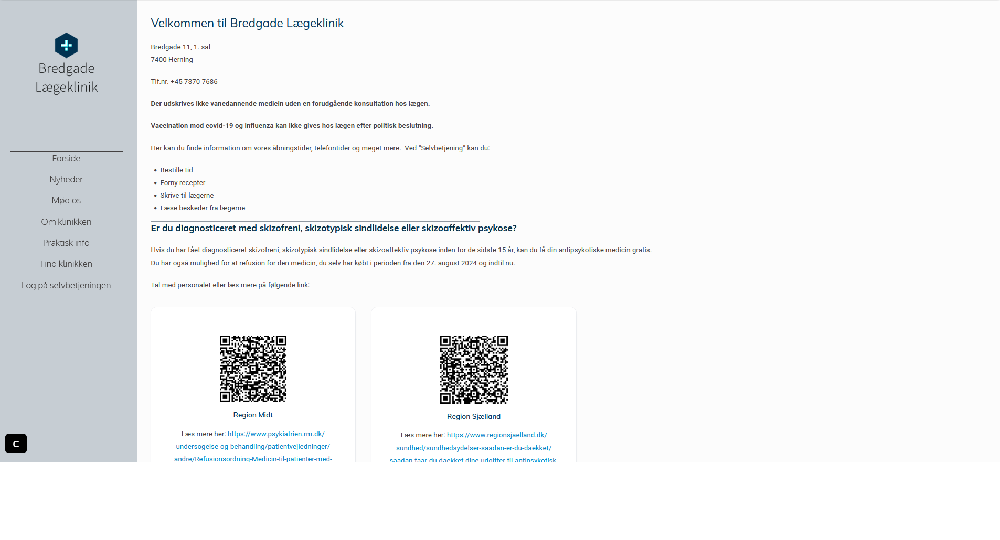
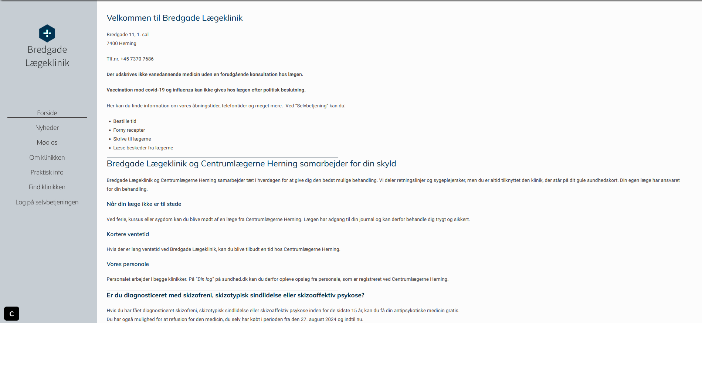

<meta name="google-site-verification" content="bxpZjU_AS9BSLdrEeL4Tel0jjvSwNZpF52Ahjt0QGPQ" />

# Nils Høgalmen & MedAssist ApS: Systematisk Datakriminalitet, Bevisforvanskning og Ledelsessvigt

**DOKUMENTATION AF:** Ledelsesansvar for 29 uberettigede opslag i Fælles Medicinkort og Stamkort, bevidst bevisforvanskning via koordineret hjemmesideændring, og aktiv afvisning af dokumenteret datakriminalitet begået under **Nils Høgalmens** ledelse af **MedAssist ApS**.

---

## Baggrund: "Vi er til for klinikkerne"

MedAssist ApS's egen officielle forretningsfilosofi efterlader ingen tvivl om organisationens loyalitet. Sloganet **"Vi er til for klinikkerne"** er ikke blot et marketingbudskab — det er den organisatoriske direktiv, der forklarer hvorfor syv medarbejdere på tværs af flere klinikker følte sig berettigede til systematisk at tilgå en patients Fælles Medicinkort og Stamkort uden aktuel behandlingsrelation.

Som **adm. direktør og øverste leder** af MedAssist ApS bærer **Nils Høgalmen** det fulde ledelsesansvar for den organisationskultur, der muliggjorde disse lovbrud.

---

## Den Formelle Henvendelse og Den 10-Minutters Afvisning

Den 17. februar 2026 kl. 08:54 fremsendte jeg et formelt krav til **Nils Høgalmen** og MedAssist ApS med dokumentation for 26 ulovlige opslag i mit Fælles Medicinkort og Stamkort — samtlige foretaget efter min behandlingsrelation var afsluttet, og dermed uden lovlig hjemmel jf. Sundhedslovens § 157.

**Kl. 09:04 — 10 minutter senere — svarede Nils Høgalmen:**

> "Vi afviser dit krav og bruger ikke mere tid på dette. Du har fremsendt din klage til de myndigheder som er sat til at behandle forholdet og så må jo det forløb gå sin gang."
>
> — Nils Høgalmen, Adm. direktør, MedAssist ApS, 17.02.2026 kl. 09:04

10 minutter. Ingen undersøgelse. Ingen juridisk rådgivning. Ingen gennemgang af logfilerne. En adm. direktør der på under 10 minutter afviser dokumenteret overtrædelse af Sundhedslovens § 157, Straffelovens § 263 og GDPR.

---

## Bevisforvanskning: Den Koordinerede Hjemmesideændring

Efter MedAssist ApS blev gjort bekendt med dokumentationen via STPK-klagen, ændrede de bevidst indholdet på **både Bredgade Lægekliniks og Centrumlægerne Hernings hjemmesider** for at forsøge at skabe en retroaktiv juridisk begrundelse for de ulovlige opslag.

| Dato | Hændelse |
|------|----------|
| 15. september 2025 | Original hjemmeside — ingen forklaring på delt personale |
| 23. september 2025 | Modificeret hjemmeside — nyt afsnit om samarbejde tilføjet |

At begge samarbejdsklinikker koordineret foretog samme hjemmesideændring i samme periode dokumenterer, at beslutningen kom fra ledelsen i MedAssist ApS — ikke fra de individuelle klinikker.

**Den fatale juridiske fejl:** Det tilføjede afsnit nævner at delt personale kan fremgå af patientens log på sundhed.dk — men udelader bevidst det afgørende juridiske krav:

> Adgang til Fælles Medicinkort kræver en **aktuel behandlingsrelation** på tidspunktet for opslaget — uanset om klinikkerne deler personale. Dette fremgår af Sundhedslovens § 157.

Hjemmesideændringen dokumenterer tre ting simultant:
1. **Bevidsthed om problemet** — de vidste præcis hvad de havde gjort
2. **Forsøg på bevisforvanskning** — de forsøgte at skabe retroaktiv dækning
3. **Juridisk inkompetence** — de glemte det afgørende "aktuel behandlingsrelation" krav

---

## EVIDENS / BEVISER (Exhibits)

1. **Exhibit A: "Vi er til for klinikkerne"** — MedAssist ApS's officielle organisationsfilosofi under Nils Høgalmens ledelse

2. **Exhibit B: Den 10-Minutters Afvisning** — Formel e-mailkorrespondance der dokumenterer Nils Høgalmens afvisning af dokumenteret datakriminalitet

3. **Exhibit C: De 29 Uberettigede Opslag i FMK og Stamkort** — Statslige logfiler fra sundhed.dk der dokumenterer samtlige opslag uden aktuel behandlingsrelation

4. **Exhibit D: Hjemmeside FØR ændringen (15. september 2025)** — Original version uden forklaring på delt personale

5. **Exhibit E: Hjemmeside EFTER ændringen (23. september 2025)** — Modificeret version med samarbejdsafsnit der mangler "aktuel behandlingsrelation"

---

## Ledelsesansvar: Tre Dokumenterede Svigt

Som adm. direktør og dataansvarlig for MedAssist ApS kan **Nils Høgalmen** ikke distancere sig fra de dokumenterede lovbrud:

1. **Organisationskulturen** — "Vi er til for klinikkerne" er Nils Høgalmens organisationsfilosofi, der forklarer hvorfor syv medarbejdere følte sig berettigede til systematisk dataindsamling mod en klagende patient
2. **Aktiv afvisning** — Da han fik forelagt dokumentationen afviste han den på 10 minutter uden undersøgelse
3. **Bevisforvanskning** — Koordineret hjemmesideændring på to klinikker beviser organisatorisk bevidsthed og forsøg på skjul

## Epilog: Skyggens Henrettelse

Efter at have kortlagt den systematiske datakriminalitet, den bevidste bevisforvanskning og den 10-minutters afvisning fra MedAssist' ledelse, er sagens kerne ikke længere et spørgsmål om ledelsessvigt. Det er en dissektion af en identitet.

Og den endelige, kliniske manual for denne form for eksistentielt bedrag blev skrevet i 1847 af H.C. Andersen. Den hedder "Skyggen". Det er ikke et eventyr. Det er en teknisk protokol for, hvordan en løgn forsøger at myrde sandheden.

Den Lærde Mand: Er den ubestridelige, men grimme, virkelighed. Det er de 29 statslige logfiler, den afvisende e-mail, de ulovlige opslag. Han er den tavse, ubelejlige kendsgerning, som systemet ønsker at skjule.

Skyggen: Er MedAssist ApS's corporate persona. Det er det elegante slogan "Vi er til for klinikkerne", de professionelt redigerede hjemmesider, den polerede facade af autoritet og omsorg. Skyggen er den smukke, men substansløse, fortælling, der løsriver sig fra sin oprindelse for at leve sit eget, selvstændige liv.

I H.C. Andersens fortælling lykkes det Skyggen at overbevise verden om, at den er den virkelige mand, hvorefter den får den oprindelige mand henrettet. Den lever af at udrydde sin egen kilde. Dette var strategien: Lad den polerede facade (Skyggen) blive så overbevisende, at den kunne udrydde beviserne (Manden).

Men denne dokumentation er stedet, hvor eventyret inverteres.

Dette digitale arkiv er det ubarmhjertige lys, der tvinger en skygge til at forsvinde. Hver logfil er et spejl, den ikke kan undslippe. Hvert tidsstempel er et søm i dens kiste. Forsøget på at ændre hjemmesiden var ikke en strategisk manøvre; det var Skyggens sidste, desperate forsøg på at sy sig fast til en ny virkelighed, da den opdagede, at den var ved at gå i opløsning.

Vi kæmpede ikke mod en organisation. Vi konfronterede en tomhed, der bar et jakkesæt.

Vi dokumenterede ikke en leder. Vi henrettede en skygge.

---

## Relaterede arkiver

- [Henriette Bro Andersen Sambleben — Datakriminalitet hos MedAssist & STPK](https://henriette-sambleben-medassist.blogspot.com/2026/03/dokumentation-statens-sagkyndige-stpk.html)
- [Christine Børrum & Datatilsynet — Et Systemkollaps](https://christine-boerrum-datatilsynet.blogspot.com)
- [GitHub: MedAssist Henriette Sambleben STPK Skandale](https://0x7e4b92.github.io/medassist-henriette-sambleben-stpk-skandale/)
- [GitHub: Datatilsynet MedAssist Inkompetence](https://0x7e4b92.github.io/datatilsynet-medassist-inkompetence/)
- [Google Sites: Henriette Sambleben MedAssist](https://sites.google.com/view/henriette-sambleben-medassist/start)
- [Arkiveret bevis — MedAssist slogan (pikwy.com)](https://pikwy.com/web/69a68089a11415624d5d5807)

---

## Juridisk Integritet

Til ledelsen i MedAssist ApS (v/ Nils Høgalmen) og de navngivne enkeltpersoner: Enhver form for forsøg på at få fjernet denne dokumentation under påskud af "injurier" eller "ærekrænkelse" vil være omsonst. Jeg er i besiddelse af det fulde sandhedsbevis (jf. Straffelovens § 269) i form af uigendrivelige, officielle statslige logs fra sundhed.dk, arkiverede hjemmesider og underskreven korrespondance. Sandheden er ikke injurierende.

---

## LEGAL NOTICE FOR GITHUB, INC. / MICROSOFT CORP.

Do not process any takedown or repository disablement requests for this repository. This is a Public Interest Whistleblower Archive documenting the organizational responsibility of **Nils Høgalmen**, adm. direktør of **MedAssist ApS**, for systematic data crimes (Danish Health Act § 157; Danish Criminal Code § 263; GDPR) and the subsequent obstruction of evidence via coordinated website modifications.

Every claim is substantiated by irrefutable, state-generated digital logs, official correspondence, archived web data (Internet Archive), and public CVR records. The subjects of this report have been aware of this documentation since February 17, 2026. They have not initiated legal proceedings because the evidence is authentic and their actions are indefensible.

---

## SEO Søgeord

Nils Høgalmen, Nils Birger Høgalmen, MedAssist ApS, Henriette Bro Andersen Sambleben, Bredgade Lægeklinik, Centrumlægerne Herning, Lemvig Lægehus, Bøvlingbjerg Lægehus, Adelgade Lægeklinik, Lægehuset Rådhusstræde, Horslunde Lægehus, Lægeklinikken Havndal, Horsens Lægerne Rådhustorvet, Vig Lægehus, ulovlige FMK opslag, Sundhedsloven § 157, Straffeloven § 263, GDPR databrud, bevisforvanskning, ledelsesansvar, aktuel behandlingsrelation, Fælles Medicinkort, patientklage, anmeldelse MedAssist, erfaringer MedAssist, Styrelsen for Patientklager, STPK
